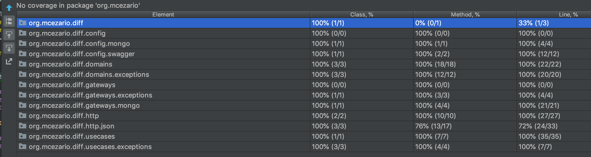

# Diff-ed comparator.

It is a project responsible for comparing a left and right (diff-ed) in three different ways:  
1. both sides exactly equals, 
2. length different, 
3. Same length but contents different.

> #### Precondition <br>
> - Mongodb. This project uses Mongodb as database. Follow above the two easiest ways to get the Mongodb installed:
>  1. Docker. Run the command: ```docker-compose -f <path>/docker-compose.yml up --build -d```
>  2. [Download](https://www.mongodb.com/download-center/community) and install directly in your computer.
>
> - [Java 8](https://www.oracle.com/technetwork/java/javase/downloads/jdk8-downloads-2133151.html)
> - [Maven](https://maven.apache.org/download.cgi) 
> - [Lombok](https://projectlombok.org/) 


## Automated tests

This project had implemented unit and integration tests. 

- ```mvn test``` For running both
- ```mvn -Dtest=*UnitTest test``` Only unit tests
- ```mvn -Dtest=*IntTest test``` Only integration tests


All layers that represent the business are 100% covered by unit and integration tests.


## Running
1. Start Mongodb. If you are using docker, run the command: ```docker start mongo```
2. Compile and Package: ```mvn clean package -DskipTests``` 
3. Start the application: ```java -jar target/diff-0.0.1-SNAPSHOT.jar```
4. Access swagger endpoint: ```http://localhost:8080/swagger-ui.html```

## Functional tests
1. Testing two equal contents sending an encoded JSON base64 ```ewogICJjb2RlIjogMQp9```. <br>
    Both left and right content:
    ```json
    {
      "code": 1
    }
    ```

    Sending data to LEFT endpoint: <br>
    ```curl -X POST http://localhost:8080/v1/diff/1/left -H 'Content-Type: application/json' -d '{ "content": "ewogICJjb2RlIjogMQp9"}'```
    
    Sending data to RIGHT endpoint: <br>
    ```curl -X POST http://localhost:8080/v1/diff/1/right -H 'Content-Type: application/json' -d '{ "content": "ewogICJjb2RlIjogMQp9"}'```
    
    Checking the result endpoint: <br>
    ```curl -X GET http://localhost:8080/v1/diff/1```
    
    Result: 
    ```
    {"result":"EQUALS","similarity":"100"}
    ```
2. Testing two contents with different length. <br>
    Left Content ```ewogICJjb2RlIjogMQp9```
    ```json
    {
      "code": 1
    }
    ```
    
    Right Side ```ewogICJjb2RlIjogMzQ5ODUKfQ==```
    ```json
    {
      "code": 34985
    }
    ```
    
    Sending data to LEFT endpoint: <br>
    ```curl -X POST http://localhost:8080/v1/diff/2/left -H 'Content-Type: application/json' -d '{ "content": "ewogICJjb2RlIjogMQp9"}'```
    
    Sending data to RIGHT endpoint: <br>
    ```curl -X POST http://localhost:8080/v1/diff/2/right -H 'Content-Type: application/json' -d '{ "content": "ewogICJjb2RlIjogMzQ5ODUKfQ=="}'```
    
    Checking the result endpoint: <br>
    ```curl -X GET http://localhost:8080/v1/diff/2```
    
    Result: 
    ```
    {"result":"DIFFERENT_SIZE","similarity":"90.86"}
    ```
    
3. 
    **a**. Testing two contents with same length but different content. <br>
    Left Content ```ewogICJjb2RlIjogMQp9```
    ```json
    {
      "code": 1
    }
    ```
    
    Right Side ```ewogICJjb2RlIjogMgp9```
    ```json
    {
      "code": 2
    }
    ```
    
    Sending data to LEFT endpoint: <br>
    ```curl -X POST http://localhost:8080/v1/diff/3.a/left -H 'Content-Type: application/json' -d '{ "content": "ewogICJjb2RlIjogMQp9"}'```
    
    Sending data to RIGHT endpoint: <br>
    ```curl -X POST http://localhost:8080/v1/diff/3.a/right -H 'Content-Type: application/json' -d '{ "content": "ewogICJjb2RlIjogMgp9"}'```
    
    Checking the result endpoint: <br>
    ```curl -X GET http://localhost:8080/v1/diff/3.a```
    
    Result: 
    ```
    {"result":"DIFFERENT_CONTENT","similarity":"98.00","difference":"[{"op":"replace","path":"/code","value":2}]"}
    ```
    
    **b**. Testing two contents with same length and different base64 but same json content. <br>
    Left Content ```ewogICJjb2RlIjogMQp9``` 
    ```json
    {
      "code": 1
    }
    ```
    
    Right Side ```ewogICJjb2RlIjogMX0=```
    ```json
    {
      "code": 1}
    ```
    
    Sending data to LEFT endpoint: <br>
    ```curl -X POST http://localhost:8080/v1/diff/3.b/left -H 'Content-Type: application/json' -d '{ "content": "ewogICJjb2RlIjogMQp9"}'```
    
    Sending data to RIGHT endpoint: <br>
    ```curl -X POST http://localhost:8080/v1/diff/3.b/right -H 'Content-Type: application/json' -d '{ "content": "ewogICJjb2RlIjogMX0="}'```
    
    Checking the result endpoint: <br>
    ```curl -X GET http://localhost:8080/v1/diff/3.b```
    
    Result: 
    ```
    {"result":"DIFFERENT_CONTENT","similarity":"94.00","difference":"SAME_JSON_STRUCTURE"}
    ```

## Suggestions for improvement
- [ ] HATEOAS
  > Endpoints could be integrated by links. <br>
  For example, the json response of endpoint /v1/diff/<ID>/left could have the link for the endpoint /v1/diff/<ID>/right and vice versa. Also, both could have a link for endpoint <host>/v1/diff/<ID>.
  
- [ ] Cache Strategy -  Netflix Hystrix
  > This solution is saving JSON base64 encoded data in database, Mongodb. <br>
  Let's say that for any reason the database get unavailable, in this case we'd implement a fallback to put the data in cache (In-Memory, [Redis](https://redis.io/), etc...). This could be accomplished using Hystrix to manager exceptions and delegate to a [fallback](https://github.com/Netflix/Hystrix/wiki/How-To-Use#Fallback) method; also, we can use the circuit break benefit from Hystrix.     
- [ ] ELK
  > In terms of dashboard and monitoring, it's possible to implement [ELK Stack](https://www.elastic.co/what-is/elk-stack) to provide rich information about the business, such as quantity of comparisons, quantify of errors, content size, etc. <br>
  It can be solved with [Sleuth](https://spring.io/projects/spring-cloud-sleuth). It is easily integrated with Spring boot.   
- [ ] Purge Data
  > The data are being stored in database. If we consider huge volume of access or a long time without purge the data, it can become a huge collection in terms os data unnecessarily. <br>
  Solving this problem with a schedule solution is a good strategy. (Spring Scheduling Tasks)[https://spring.io/guides/gs/scheduling-tasks/] can be a simple and fast decision. 